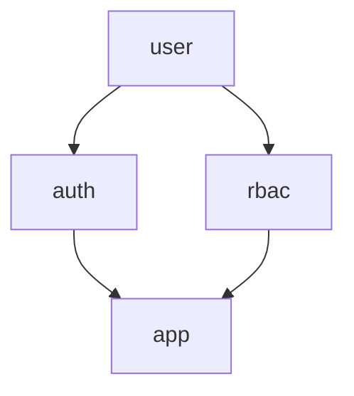

# webtyp/user


Stable identity value contract for the WebTyp ecosystem. Authentication,
sessions, concrete providers, and authorization live in sibling libraries
`webtyp.com/auth` and `webtyp.com/rbac`.

## Package Structure

| Package | Purpose |
|---|---|
| `webtyp.com/user` | WASM-safe root package defining `SubjectID` and `Subject` |
| `webtyp.com/auth` | Authentication, sessions, credential modes, OAuth2, providers, `auth/local` |
| `webtyp.com/rbac` | Roles, permissions, assignments, `Can` |

Dependency direction: `auth` and `rbac` import `user`; neither imports the
other. Only the application composition root imports both.



## Documentation

- [docs/ARCHITECTURE.md](docs/ARCHITECTURE.md) — Dependency graph and retained contract
- [docs/DESIGN.md](docs/DESIGN.md) — Rejected alternatives and local authenticator rationale
- [docs/SKILL.md](docs/SKILL.md) — Minimal API contract

## Usage

```go
import (
    "webtyp.com/user"
    "webtyp.com/auth/authority"
    "webtyp.com/auth/oauth2"
    "webtyp.com/auth/oauth2/provider/google"
    "webtyp.com/rbac"
    "webtyp.com/orm"
    "webtyp.com/sqlite"
    "webtyp.com/unixid"
)

ids, _ := unixid.NewUnixID()
conn, _ := sqlite.Open("app.db")
db := orm.New(conn)

// auth owns subjects and sessions
mod, _ := authority.New(db, auth.Config{IDs: ids})
gProv := &google.GoogleProvider{
    ClientID:     "client-id",
    ClientSecret: "secret",
    RedirectURL:  "https://example.com" + auth.PathOAuthCallback(google.ProviderName),
}
mod.Enable(oauth2.New(mod, mod, mod, []auth.OAuthProvider{gProv}))

// rbac owns assignments by SubjectID
rb, _ := rbac.New(db)

// composition root wires them: sessions from auth, authorization from rbac
// middleware: mod.Authenticate() sets ctx.UserID to string(user.SubjectID)
// authorize: rb.Can(ctx.UserID(), resource, action)
```

Local development: build a `local` authenticator with explicit scenarios and
mount it in the development composition root. Production builds use only the
Google provider and never register `local`. See `webtyp.com/auth/local`.

## Status

Stable `SubjectID`/`Subject` contract. See [docs/ARCHITECTURE.md](docs/ARCHITECTURE.md)
for dependency rules.
