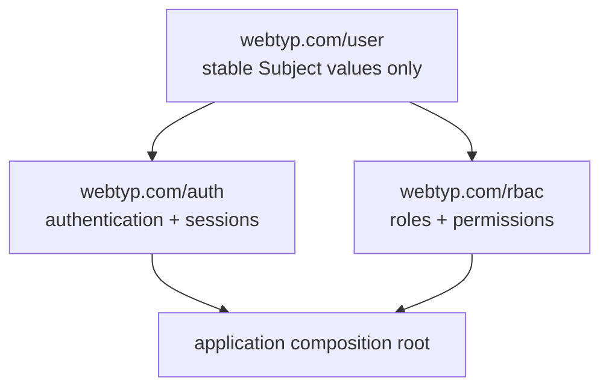

# Architecture

`webtyp/user` is the stable, lightweight identity contract for the WebTyp
ecosystem. It contains only value types needed to pass an authenticated identity
across transport boundaries. Authentication, sessions, OAuth providers, and
authorization live in sibling libraries.

## Dependency Graph



One-way rules:

- `user` depends only on the minimal shared WebTyp value packages required to
  transport `Subject`. It imports neither `auth`, `rbac`, `orm`, `fetch`, `jwt`,
  nor any concrete provider.
- `auth` imports `user` and may depend on its own persistence/runtime
  dependencies. It never imports `rbac`.
- `rbac` imports `user` and may depend on its own persistence/runtime
  dependencies. It never imports `auth`.
- Only the application composition root imports both `auth` and `rbac`. It wires
  the narrow ports between them.
- No compatibility packages remain at
  `webtyp.com/user/{authority,oauth2,email_password,trusted_ip,session}`.

## Retained Public Contract

The root package exports exactly two domain values. It is not a service or
adapter package:

```go
type SubjectID string

type Subject struct {
    ID     SubjectID
    Email  string
    Name   string
    Avatar string
}
```

`SubjectID` is the only cross-library reference to a signed-in person.
`auth` owns resolving and creating `Subject`; `rbac` stores and evaluates
assignments by `SubjectID`; applications display a `Subject` returned by `auth`.

The root may contain value-only encoding helpers required to pass `Subject`
across the WebTyp typed transport. It contains no router route,
authentication interface, session interface, OAuth type, persistence port, error
value, model definition, CRUD presenter, event topic, or policy.

## Design Principles

- **WASM-safe**: no Go standard-library dependency in code reachable from
  WASM/TinyGo. Uses `webtyp.com/fmt` where needed.
- **Typed and explicit**: subject identity has one representation.
- **Narrow ports**: sibling libraries receive interfaces they need, never a
  concrete sibling module or database handle merely to reach another service.
- **Every repeated string is a package constant** in the owning module. The root
  defines none.
